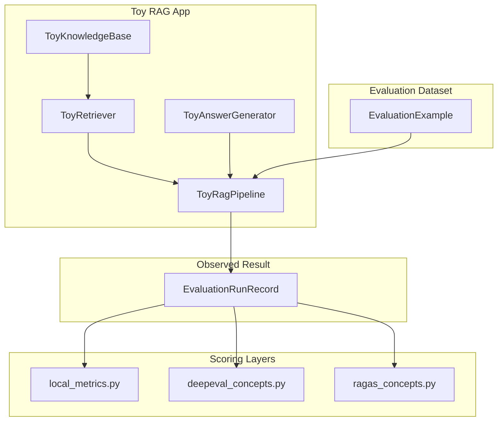

# Architecture

This page explains how the lab modules fit together and how data flows through evaluation.

## High-Level Flow



The same `EvaluationRunRecord` feeds all three scoring layers. That is the core design: **one neutral data model, multiple framework adapters**.

## Module Reference

### `toy_rag.py` — System Under Test

| Class | Role |
|-------|------|
| `Document` | A chunk of knowledge (id, text, topic) |
| `ToyKnowledgeBase` | In-memory document store |
| `ToyRetriever` | Keyword-overlap retrieval (top-k) |
| `ToyAnswerGenerator` | Deterministic answer synthesis |
| `ToyRagPipeline` | Wires retriever + generator |

Key methods:

- `answer(question)` — black-box use (returns only the final string)
- `run_example(example)` — evaluation use (returns full `EvaluationRunRecord`)

`build_default_pipeline()` creates the default knowledge base with four documents about DeepEval, Ragas, faithfulness, and retrieval quality.

### `eval_dataset.py` — Framework-Neutral Data

| Class | Role |
|-------|------|
| `EvaluationExample` | Input + gold answer + gold contexts + tags |
| `EvaluationRunRecord` | Example + actual answer + retrieved contexts |

`load_examples()` returns three scenarios covering DeepEval, faithfulness, and Ragas.

### `local_metrics.py` — Deterministic Scoring

| Class | Approximates |
|-------|--------------|
| `KeywordRecallMetric` | Answer correctness vs reference |
| `ContextPrecisionMetric` | Retriever focus vs gold contexts |
| `FaithfulnessHeuristicMetric` | Answer grounding in retrieved text |

`score_record(record)` runs all three and returns `MetricResult` objects with name, score, passed, and reason.

### `deepeval_concepts.py` — DeepEval Adapter

`DeepEvalConceptFactory` translates records into DeepEval types:

| Our field | DeepEval field |
|-----------|----------------|
| `question` | `input` |
| `actual_answer` | `actual_output` |
| `reference_answer` | `expected_output` |
| `retrieved_contexts` | `retrieval_context` |
| `reference_contexts` | `context` |

Factory methods:

- `build_test_case()` → `LLMTestCase`
- `build_rag_metrics()` → answer relevancy, faithfulness, contextual metrics
- `build_safety_metrics()` → bias, toxicity
- `build_custom_correctness_metric()` → G-Eval rubric

`assert_record_with_deepeval()` runs `deepeval.assert_test()` for pytest-style pass/fail.

### `ragas_concepts.py` — Ragas Adapter

`RagasConceptFactory` translates records into Ragas types:

| Our field | Ragas field |
|-----------|-------------|
| `question` | `user_input` |
| `actual_answer` | `response` |
| `retrieved_contexts` | `retrieved_contexts` |
| `reference_answer` | `reference` |
| `reference_contexts` | `reference_contexts` |

Factory methods:

- `build_sample()` → `SingleTurnSample`
- `build_dataset()` → `EvaluationDataset`
- `build_rag_metrics()` → faithfulness, answer relevancy, context precision/recall
- `build_rubric_metric()` → `RubricsScoreWithReference`

Async helpers: `score_record_with_ragas()`, `evaluate_records_with_ragas()`.

### `compat.py` — Dependency Shims

`install_ragas_vertexai_import_shim()` prevents Ragas 0.4 from failing on an optional VertexAI import when you only use OpenAI.

### `cli.py` — Learning Interface

| Command | What it does |
|---------|--------------|
| `ask` | Query the toy RAG app |
| `inspect-dataset` | Show all evaluation records |
| `score-local` | Run deterministic metrics |
| `deepeval-smoke` | One DeepEval assertion (needs API key) |
| `ragas-smoke` | One Ragas metric (needs API key) |

`ConsoleReporter` separates presentation from scoring so you could swap in JSON output later.

## Test Layout

```
tests/                          # API-free unit tests (run in CI)
evals/deepeval/                 # DeepEval test file (needs API key)
examples/                       # Standalone demo scripts
```

## Extension Points

To evaluate your own RAG app:

1. Replace `ToyRagPipeline` with your app, but keep returning `EvaluationRunRecord`.
2. Add examples to `load_examples()` or load from JSON/CSV.
3. Reuse `score_record()`, `assert_record_with_deepeval()`, or `evaluate_records_with_ragas()`.
4. Add local metrics in `local_metrics.py` for fast regression checks.
