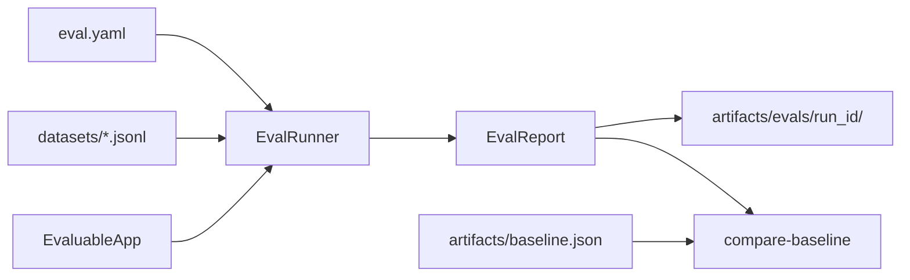

# Production Evaluation Workflow

This guide explains how to run structured evaluations, write artifacts, gate regressions in CI, and plug in your own RAG application.

## Overview



Every eval run produces the same `EvalReport` schema regardless of which metric backend scored the records. Today the runner enables **local metrics by default**; DeepEval and Ragas remain opt-in via their adapters and smoke commands.

## Quick Start

```bash
# Full suite with console output
poetry run llm-eval-lab run-eval

# Full suite + JSON artifacts
poetry run llm-eval-lab run-eval --format both

# Compare a report against the committed baseline
poetry run llm-eval-lab compare-baseline artifacts/ci-report.json
```

Shorthand commands still work and delegate to `EvalRunner`:

```bash
poetry run llm-eval-lab score-local
poetry run llm-eval-lab inspect-dataset
```

## Configuration Reference

`eval.yaml` controls the evaluation suite:

```yaml
dataset: datasets/default.jsonl
tags: []                    # empty = all examples; e.g. ["rag"] to filter
metrics:
  local:
    enabled: true
    thresholds:
      keyword_recall: 0.55
      context_precision: 0.5
      faithfulness_heuristic: 0.45
  deepeval:
    enabled: false          # opt-in; not wired into EvalRunner yet
    threshold: 0.5
    model: gpt-4o-mini
  ragas:
    enabled: false
    model: gpt-4o-mini
    embedding_model: text-embedding-3-small
artifacts_dir: artifacts/evals
regression:
  max_mean_score_drop: 0.05
```

| Setting | Purpose |
|---------|---------|
| `dataset` | Path to JSONL (relative to repo root or absolute) |
| `tags` | Run only examples whose `tags` intersect this list |
| `metrics.local.enabled` | Toggle deterministic local scoring |
| `metrics.local.thresholds` | Per-metric pass thresholds (0.0–1.0) |
| `artifacts_dir` | Root directory for `run-eval --format json\|both` |
| `regression.max_mean_score_drop` | Max allowed drop in mean score vs baseline |

Load config programmatically:

```python
from pathlib import Path
from llm_eval_lab.config import load_config

config = load_config(Path("eval.yaml"))
```

## Dataset Format

Examples live in JSONL — one JSON object per line. See `datasets/default.jsonl`:

```json
{
  "question": "What is DeepEval useful for?",
  "reference_answer": "DeepEval is useful for testing LLM applications...",
  "reference_contexts": [
    "DeepEval is an LLM evaluation framework that works like pytest for LLM apps."
  ],
  "tags": ["deepeval", "framework"]
}
```

Load from code:

```python
from llm_eval_lab.eval_dataset import load_examples, load_examples_from_file

examples = load_examples()                          # default JSONL
examples = load_examples_from_file(path)            # custom file
```

## EvalRunner and EvaluableApp

`src/llm_eval_lab/runner.py` orchestrates the suite:

1. Load config and dataset
2. Filter examples by `tags`
3. Run each example through an `EvaluableApp`
4. Score records with enabled metric backends
5. Return an `EvalReport`

```python
from llm_eval_lab.runner import EvalRunner, run_default_eval

report = run_default_eval()
print(report.summary.pass_rate)
print(report.summary.mean_scores)
```

### Plug In Your Own RAG App

Implement the `EvaluableApp` protocol:

```python
from llm_eval_lab.eval_dataset import EvaluationExample, EvaluationRunRecord
from llm_eval_lab.runner import EvalRunner


class MyRagApp:
    def run_example(self, example: EvaluationExample) -> EvaluationRunRecord:
        retrieved = my_retriever.search(example.question)
        answer = my_generator.generate(example.question, retrieved)
        return EvaluationRunRecord(
            example=example,
            actual_answer=answer,
            retrieved_contexts=retrieved,
        )


report = EvalRunner().run(app=MyRagApp())
```

The same `EvaluationRunRecord` feeds local metrics, DeepEval adapters, and Ragas adapters.

## EvalReport Schema

`src/llm_eval_lab/reporting.py` defines the artifact schema:

| Model | Fields | Purpose |
|-------|--------|---------|
| `RecordScore` | `question`, `metric`, `score`, `passed`, `reason`, `backend` | One metric result for one example |
| `EvalRunSummary` | `pass_rate`, `mean_scores`, `failed_questions`, counts | Aggregates across the run |
| `EvalReport` | `run_id`, `timestamp`, `git_sha`, `config_hash`, `records`, `scores`, `summary` | Full run artifact |

Example summary from the default toy RAG (as of baseline):

| Metric | Mean score |
|--------|------------|
| `keyword_recall` | 0.698 |
| `context_precision` | 0.475 |
| `faithfulness_heuristic` | 0.776 |

Pass rate: **88.9%** (8 of 9 local metric checks pass; one `context_precision` failure on the faithfulness example).

## Artifacts

`run-eval --format json` or `--format both` writes:

```
artifacts/evals/<run_id>/report.json   # full EvalReport JSON
artifacts/evals/<run_id>/summary.md    # human-readable summary
```

Load a report:

```python
from pathlib import Path
from llm_eval_lab.reporting import load_report

report = load_report(Path("artifacts/evals/<run_id>/report.json"))
```

The committed baseline at `artifacts/baseline.json` is a known-good `EvalReport` used for regression gates.

### Updating the Baseline

After an intentional improvement to the toy RAG or thresholds:

```bash
poetry run llm-eval-lab run-eval --format both
cp artifacts/evals/<run_id>/report.json artifacts/baseline.json
poetry run pytest   # golden tests should still pass or be updated deliberately
git add artifacts/baseline.json
```

## Regression Gates

`src/llm_eval_lab/regression.py` compares a current report to the baseline:

| Check | Fails when |
|-------|------------|
| Mean score drop | Any metric mean drops more than `max_mean_score_drop` (default 0.05) |
| Pass-to-fail | A local metric passed in baseline but fails now |
| Missing metric | A metric present in baseline is absent in current run |

CLI:

```bash
poetry run llm-eval-lab compare-baseline path/to/report.json
poetry run llm-eval-lab compare-baseline path/to/report.json --baseline artifacts/baseline.json
```

Exit code `0` = passed, `1` = regression detected (usable in CI scripts).

Programmatic:

```python
from llm_eval_lab.regression import compare_reports
from llm_eval_lab.reporting import load_report

current = load_report(current_path)
baseline = load_report(baseline_path)
result = compare_reports(current, baseline)
assert result.passed, result.issues
```

## CI Integration

`.github/workflows/ci.yml` runs on every push and pull request to `main`:

1. **Ruff** — lint
2. **Mypy** — type check
3. **Pytest** — 19 tests including golden local metric scores
4. **Regression gate** — fresh eval vs `artifacts/baseline.json`

LLM-as-judge tests (`deepeval-smoke`, `evals/deepeval/`) are **not** in CI — they require `OPENAI_API_KEY` and are slower. Run them locally or on a scheduled workflow with secrets.

### Local Pre-Commit

```bash
poetry run pre-commit install
poetry run pre-commit run --all-files
```

Hooks: ruff (lint + format), mypy.

## Recommended Production Workflow

| When | What to run | API key? |
|------|-------------|----------|
| Every commit / PR | `pytest`, `compare-baseline` (via CI) | No |
| After retrieval/generation changes | `run-eval --format both` | No |
| Before release | `deepeval test run evals/deepeval/...` | Yes |
| Scheduled / on demand | Full Ragas dataset eval | Yes |

## CLI Reference

| Command | Description |
|---------|-------------|
| `run-eval [--config PATH] [--format console\|json\|both]` | Full suite via `EvalRunner` |
| `compare-baseline REPORT [--baseline PATH]` | Regression gate |
| `score-local [--config PATH]` | Local metrics only (console) |
| `inspect-dataset [--config PATH]` | Records table (console) |
| `ask QUESTION` | Query toy RAG |
| `deepeval-smoke` | One DeepEval assertion |
| `ragas-smoke` | One Ragas metric |

## Related Docs

- [Architecture](architecture.md) — module reference and data flow
- [Concepts](concepts.md) — what each metric measures
- [Getting Started](getting-started.md) — install and first commands
