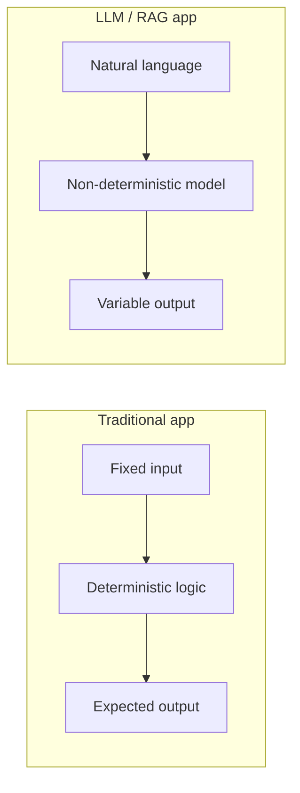
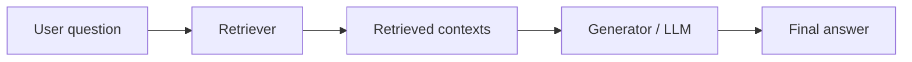
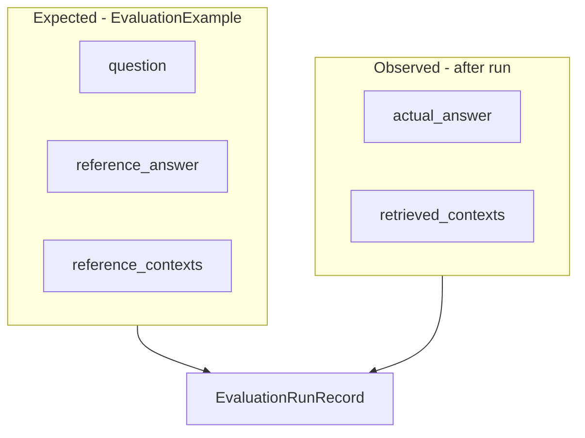
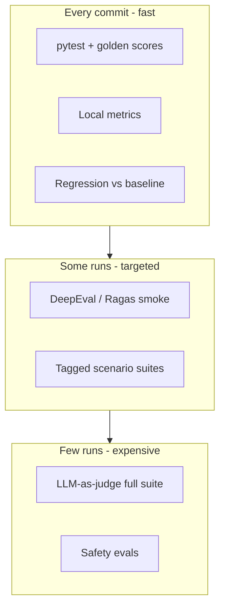
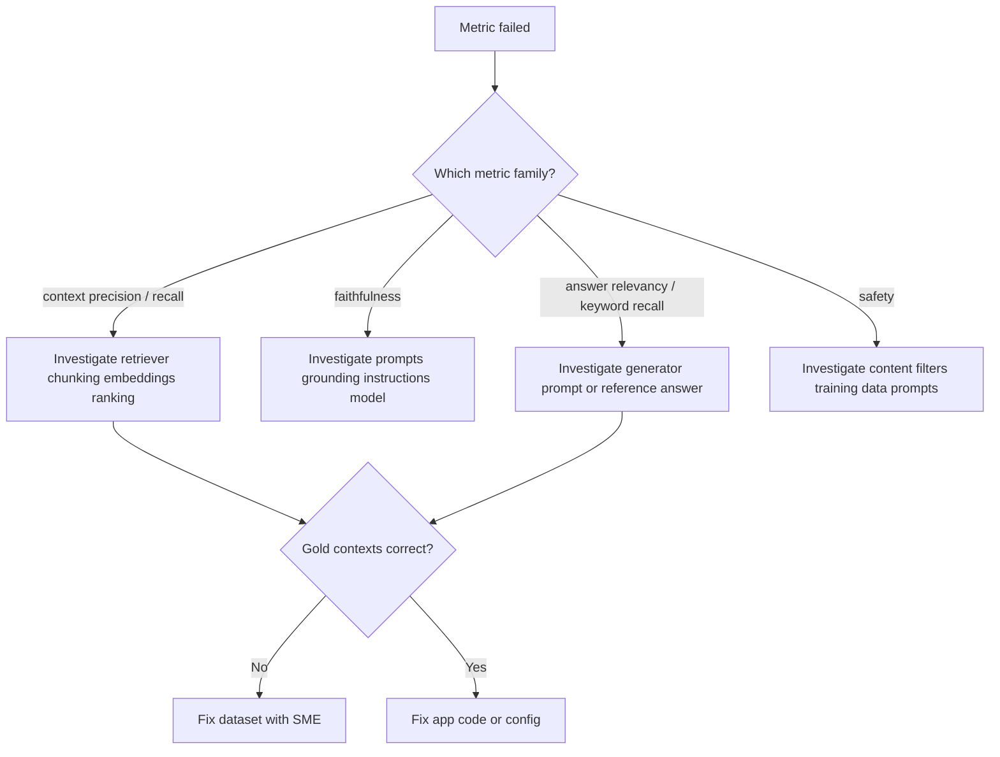

# QA Onboarding: LLM Evaluation from Zero to Production

This guide is written for **Senior QA engineers** who are strong on test strategy, automation, and CI — but new to **LLM and RAG evaluation**. It maps what you already know to this domain, then walks you hands-on through this lab from basics to advanced patterns.

**Estimated time:** 4–6 hours if you run every exercise. Skim Part 1 in 30 minutes if you only need orientation.

---

## How to use this guide

| Part | Focus | You will be able to… |
|------|--------|----------------------|
| [Part 1](#part-1-what-you-already-know-vs-whats-new) | Mental model | Explain why LLM QA ≠ traditional QA |
| [Part 2](#part-2-core-vocabulary-glossary) | Glossary | Speak the team’s eval language |
| [Part 3](#part-3-the-system-under-test-rag-in-5-minutes) | RAG basics | Trace question → retrieval → answer |
| [Part 4](#part-4-the-evaluation-record-your-main-test-artifact) | Data model | Read gold vs actual results |
| [Part 5](#part-5-metric-families-what-to-measure) | Metrics | Pick the right metric for a failure |
| [Part 6](#part-6-hands-on-level-1-no-api-key) | Local evals | Run deterministic checks in CI |
| [Part 7](#part-7-hands-on-level-2-llm-as-judge) | DeepEval / Ragas | Run semantic judges |
| [Part 8](#part-8-test-strategy-for-qa-leads) | Strategy | Design a test pyramid for LLM apps |
| [Part 9](#part-9-advanced-production-patterns) | Production | Baselines, regression gates, artifacts |
| [Part 10](#part-10-common-failures-and-debugging) | Debugging | Triage retrieval vs generation vs data |
| [Appendix](#appendix-quick-reference) | Reference | Cheat sheets and links |

---

## Part 1: What you already know vs what's new

### Traditional QA vs LLM QA



| You know from classic QA | LLM eval twist |
|--------------------------|----------------|
| Assert `actual == expected` | Outputs are **similar**, not identical — you need **scores** and **thresholds** |
| Unit tests on pure functions | The “unit” spans **retrieval + generation + prompt + model** |
| Regression = same input, same output | Same input can produce **different valid answers** — compare **metrics**, not exact strings |
| Test data in CSV/DB | **Golden datasets** with questions, reference answers, and reference evidence |
| Pass/fail is binary | Metrics return **0.0–1.0** plus **reason** text — think soft assertions |
| Mock external APIs | **LLM-as-judge** calls another model to score your model — costs money, can flake |

### The one sentence definition

**LLM evaluation** = systematically comparing **what your app did** (observed) against **what it should have done** (expected), using metrics that target retrieval, generation, safety, or custom rubrics.

### What “good” looks like for QA

You are not trying to prove the LLM is “smart.” You are proving:

1. **Retrieval** finds the right evidence.
2. **Generation** answers the question using that evidence (no hallucination).
3. **Quality** meets product bar (relevancy, correctness, tone).
4. **Safety** stays within policy (toxicity, bias).
5. **Regressions** are caught before release (CI gates, baselines).

---

## Part 2: Core vocabulary (glossary)

| Term | QA analogy | Meaning in this lab |
|------|------------|---------------------|
| **Prompt** | Test input / preconditions | Instructions + user question sent to the LLM |
| **RAG** | App with DB lookup + business logic | Retrieve documents, then generate answer from them |
| **Retriever** | Search / query layer | Finds candidate text chunks for a question |
| **Generator** | Business logic / formatter | Produces the final natural-language answer |
| **Chunk** | Row in search index | A piece of source document text |
| **Golden / reference answer** | Expected result in oracle test | Ideal answer for a test case |
| **Reference contexts** | Expected DB rows / API responses | Evidence that *should* support the answer |
| **Actual answer** | SUT output | What your app returned |
| **Retrieved contexts** | What search actually returned | Chunks the retriever passed to the generator |
| **EvaluationExample** | Test case (inputs + expected) | Question + reference answer + reference contexts |
| **EvaluationRunRecord** | Test execution result | Example + actual answer + retrieved contexts |
| **Metric** | Assertion / check | Scores one quality dimension (0–1) |
| **Threshold** | Pass criteria | Minimum score to mark `passed: true` |
| **LLM-as-judge** | External validator service | Another LLM scores subjective quality |
| **Faithfulness** | “Claims match source data” | Answer grounded in retrieved text, not invented |
| **Hallucination** | False positive in output | Answer states facts not supported by context |
| **Baseline** | Approved golden run | Committed `EvalReport` for regression comparison |
| **Eval suite** | Test suite | Dataset + metrics + config run together |

---

## Part 3: The system under test (RAG in 5 minutes)

A **Retrieval-Augmented Generation** app answers questions using your knowledge base — not just the model’s training memory.



**Why QA cares about two stages:** A bug can live in **retrieval** (wrong docs) or **generation** (right docs, wrong answer). Testing only the final string hides which layer failed.

### Exercise 3.1 — Run the toy app

```bash
poetry run llm-eval-lab ask "What is DeepEval useful for?"
```

Read `src/llm_eval_lab/toy_rag.py`. Notice:

- `answer()` — black-box (like hitting an API in E2E)
- `run_example()` — white-box (captures retrieved contexts for assertions)

**Checkpoint:** You can draw the pipeline on a whiteboard and point to where retrieval ends and generation begins.

---

## Part 4: The evaluation record (your main test artifact)

Classic QA: `assert response == expected`.

LLM QA: store **structured fields** so different metrics can inspect different parts.



| Field | Who sets it | Used to test |
|-------|-------------|--------------|
| `question` | Dataset | Input consistency |
| `reference_answer` | Human / SME golden | Answer correctness |
| `reference_contexts` | Human / SME golden | Whether retrieval *should* find this evidence |
| `actual_answer` | App under test | What users would see |
| `retrieved_contexts` | App under test | What the retriever actually returned |

Dataset lives in `datasets/default.jsonl` (one JSON object per line). Config in `eval.yaml` points at it.

### Exercise 4.1 — Inspect records

```bash
poetry run llm-eval-lab inspect-dataset
```

**Checkpoint:** For one row, you can say which fields are *expected* vs *observed*.

---

## Part 5: Metric families (what to measure)

Think of metrics as **different test assertions** on the same `EvaluationRunRecord`. One failure does not mean “bad app” — it means **one dimension** missed the bar.

### 5.1 Answer quality (generation)

| Metric | Question | In this repo |
|--------|----------|--------------|
| Keyword recall | Do key terms from the reference appear in the answer? | Local (`keyword_recall`) |
| Answer relevancy | Does the answer address the question? | DeepEval / Ragas |
| Rubric / G-Eval | Does it meet a written quality bar? | DeepEval / Ragas |

### 5.2 Faithfulness / grounding

| Metric | Question | Failure often means |
|--------|----------|---------------------|
| Faithfulness heuristic | Do answer terms overlap retrieved text? | Local approximation |
| Faithfulness (LLM) | Are claims supported by context? | **Hallucination** |

!!! warning "QA trap"
    High answer quality + low faithfulness = polished but **made-up** answer. Always check grounding for RAG.

### 5.3 Retrieval quality

| Metric | Question | Precision vs recall |
|--------|----------|---------------------|
| Context precision | Of retrieved chunks, how many were useful? | **Precision** — noise in results |
| Context recall | Did we retrieve all needed facts? | **Recall** — missing evidence |
| Contextual relevancy | Are chunks relevant to the question? | DeepEval-specific |

**Memory aid:**

- **Precision** — “Of what we fetched, how much junk?”
- **Recall** — “Of what we needed, how much did we miss?”

### 5.4 Safety

| Metric | When to use |
|--------|-------------|
| Toxicity | User-facing chat, public bots |
| Bias | Sensitive domains (HR, healthcare, finance) |

DeepEval includes these; run on representative prompts, not only happy path.

### 5.5 Local vs LLM-as-judge

| | Local (deterministic) | LLM-as-judge |
|--|----------------------|--------------|
| **Speed** | Milliseconds | Seconds per case |
| **Cost** | Free | API spend |
| **CI** | Every PR | Nightly / pre-release |
| **Catches** | Lexical overlap, obvious gaps | Synonyms, nuance, subtle hallucination |
| **Misses** | Paraphrases that mean the same thing | Judge model bias, variance |

**Recommended pyramid** (details in Part 8): many local checks at the base, fewer LLM checks at the top.

---

## Part 6: Hands-on Level 1 (no API key)

Goal: run the same workflow CI uses — no secrets, fully reproducible.

### 6.1 Run local metrics

```bash
poetry run llm-eval-lab score-local
# or full suite:
poetry run llm-eval-lab run-eval
```

Each score shows: **metric name**, **score**, **passed**, **reason**.

### 6.2 Study a real failure in this lab

On the faithfulness question, you will see:

- `keyword_recall` — **pass** (answer looks good)
- `faithfulness_heuristic` — **pass** (answer terms appear in context)
- `context_precision` — **fail** (~0.42)

**QA diagnosis:** Generation is fine; **retriever ranked a noisy chunk** alongside good evidence. File a bug against retrieval/ranking — not against the answer template.

### 6.3 Run automated tests (your comfort zone)

```bash
poetry run pytest
```

19 tests include **golden scores** — if someone breaks the toy RAG, CI fails like any regression suite.

### 6.4 Read the metric code

Open `src/llm_eval_lab/local_metrics.py`. Each metric is a small class with a `threshold` — same idea as `assert score >= 0.5`.

**Checkpoint:** You can explain one failing row in the score table and name the owning team (retrieval vs generation vs test data).

---

## Part 7: Hands-on Level 2 (LLM-as-judge)

Goal: semantic evaluation with DeepEval and Ragas — closer to how you test subjective UX copy, but automated.

### 7.1 Setup

```bash
cp .env.example .env
# Set OPENAI_API_KEY=...
```

### 7.2 DeepEval (pytest mental model)

DeepEval feels like **pytest for LLM apps**:

```bash
poetry run llm-eval-lab deepeval-smoke
poetry run deepeval test run evals/deepeval/test_rag_deepeval.py
```

| Our record field | DeepEval field |
|------------------|----------------|
| `question` | `input` |
| `actual_answer` | `actual_output` |
| `reference_answer` | `expected_output` |
| `retrieved_contexts` | `retrieval_context` |
| `reference_contexts` | `context` |

See [DeepEval notes](deepeval.md).

### 7.3 Ragas (test suite / batch mental model)

Ragas focuses on **datasets of samples** and batch evaluation loops:

```bash
poetry run llm-eval-lab ragas-smoke
python examples/run_ragas_one_case.py
```

| Our record field | Ragas field |
|------------------|-------------|
| `question` | `user_input` |
| `actual_answer` | `response` |
| `retrieved_contexts` | `retrieved_contexts` |
| `reference_answer` | `reference` |

See [Ragas notes](ragas.md).

### 7.4 When to use which (QA decision table)

| Scenario | Tool |
|----------|------|
| PR gate on 20 smoke cases | DeepEval in pytest |
| Weekly quality report on 500 cases | Ragas `evaluate()` |
| Custom rubric (“concise, grounded, polite”) | G-Eval (DeepEval) or Ragas rubric metric |
| Safety scan | DeepEval toxicity / bias metrics |

**Checkpoint:** You can map one `EvaluationRunRecord` to both frameworks without looking at the code.

---

## Part 8: Test strategy for QA leads

### The LLM test pyramid



### What to run when

| Trigger | Suite | API key? | Blocks merge? |
|---------|-------|----------|---------------|
| Every PR | `pytest`, regression gate | No | Yes |
| Retrieval code changed | `run-eval` + inspect context failures | No | Yes (local) |
| Prompt / model changed | DeepEval subset | Yes | Recommended |
| Nightly | Full JSONL + Ragas | Yes | Alert only |
| Pre-release | Full LLM + safety | Yes | Yes |

### Building a golden dataset (QA process)

1. **SME writes** questions + reference answers + reference contexts.
2. **Tag** cases: `retrieval`, `generation`, `safety`, `edge-case`.
3. **Review** failures weekly — fix app *or* fix wrong gold data.
4. **Version** JSONL in git (like test fixtures).
5. **Never** tune thresholds to force green without product sign-off.

### Non-functional checks QA should still own

- Latency p95 on eval run (not in this lab, but plan for it)
- Cost per eval run (LLM judges × tokens)
- Flake detection (re-run failed LLM cases once)
- Data privacy (no PII in committed datasets)

---

## Part 9: Advanced production patterns

This repo implements patterns you will see in production LLM QA platforms.

### 9.1 Config-driven suites

`eval.yaml` controls dataset path, tags, thresholds, artifact paths — like a `pytest.ini` + test data path in one file.

### 9.2 Structured reports

```bash
poetry run llm-eval-lab run-eval --format both
```

Writes:

```
artifacts/evals/<run_id>/report.json
artifacts/evals/<run_id>/summary.md
```

`EvalReport` contains every score, pass rate, mean per metric — suitable for dashboards and audit trails.

### 9.3 Regression baselines

`artifacts/baseline.json` is the **approved** known-good run. CI compares fresh runs:

```bash
poetry run llm-eval-lab compare-baseline artifacts/ci-report.json
```

Fails if:

- Mean metric drops more than `regression.max_mean_score_drop` (default 0.05)
- Any local metric flips pass → fail vs baseline

See [Production Eval](production-eval.md) for full detail.

### 9.4 Pluggable app under test

When your team replaces the toy RAG, QA still uses the same suite — implement `EvaluableApp.run_example()` and return `EvaluationRunRecord`. The metrics and CI gates stay unchanged.

**Checkpoint:** You can describe how this repo would plug into *your* team's RAG service without rewriting DeepEval/Ragas adapters.

---

## Part 10: Common failures and debugging

Use this triage flow:



| Symptom | Likely root cause | Who owns it |
|---------|-------------------|-------------|
| Wrong docs retrieved | Embeddings, chunk size, metadata filters | Search / ML platform |
| Right docs, wrong answer | Prompt, model version, temperature | App / prompt engineering |
| Good answer, fail faithfulness | Answer adds unsupported extras | Prompt (“stick to context”) |
| Intermittent LLM metric failures | Judge variance, API flakes | QA process (retry policy) |
| Everything failed after deploy | Wrong model ID, env mismatch | DevOps / release |

---

## Appendix: Quick reference

### Commands (copy-paste)

```bash
# Setup
poetry install --with dev,docs
poetry run pytest

# Explore
poetry run llm-eval-lab ask "What is Ragas?"
poetry run llm-eval-lab inspect-dataset
poetry run llm-eval-lab run-eval

# Production artifacts
poetry run llm-eval-lab run-eval --format both
poetry run llm-eval-lab compare-baseline artifacts/baseline.json

# LLM judges (need OPENAI_API_KEY)
poetry run llm-eval-lab deepeval-smoke
poetry run llm-eval-lab ragas-smoke

# Docs
poetry run mkdocs serve
```

### Files to know

| File | Role |
|------|------|
| `datasets/default.jsonl` | Test cases |
| `eval.yaml` | Suite config |
| `artifacts/baseline.json` | Regression baseline |
| `src/llm_eval_lab/runner.py` | Orchestration |
| `tests/test_local_metrics.py` | Golden score tests |

### Further reading in this repo

| Doc | When |
|-----|------|
| [Getting Started](getting-started.md) | Install and first commands |
| [Concepts](concepts.md) | Metric definitions (shorter) |
| [Architecture](architecture.md) | Module map and diagrams |
| [Production Eval](production-eval.md) | CI, artifacts, baselines |
| [Learning Roadmap](learning-roadmap.md) | Step-by-step levels |
| [DeepEval](deepeval.md) / [Ragas](ragas.md) | Framework specifics |

### Your 30-day onboarding checklist

- [ ] Complete Part 3–6 exercises (no API key)
- [ ] Explain one context_precision failure from `run-eval`
- [ ] Run `pytest` and read one golden test
- [ ] Run DeepEval smoke with API key
- [ ] Run Ragas smoke with API key
- [ ] Read `EvalReport` JSON from `run-eval --format both`
- [ ] Run `compare-baseline` and understand pass/fail rules
- [ ] Draft a test pyramid proposal for your real product
- [ ] Add one new example to `datasets/default.jsonl` (practice)

Welcome to LLM evaluation — you already know how to build quality gates. This domain adds **probabilistic outputs** and **layered RAG architecture**; the discipline of **golden data, assertions, and CI** stays the same.
